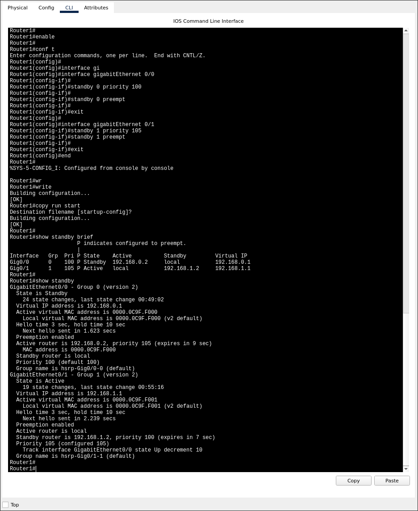
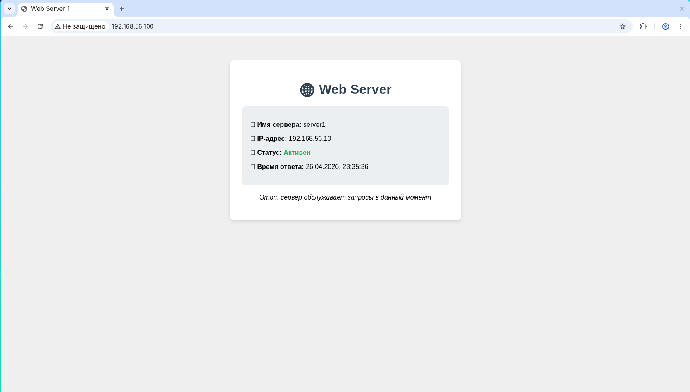
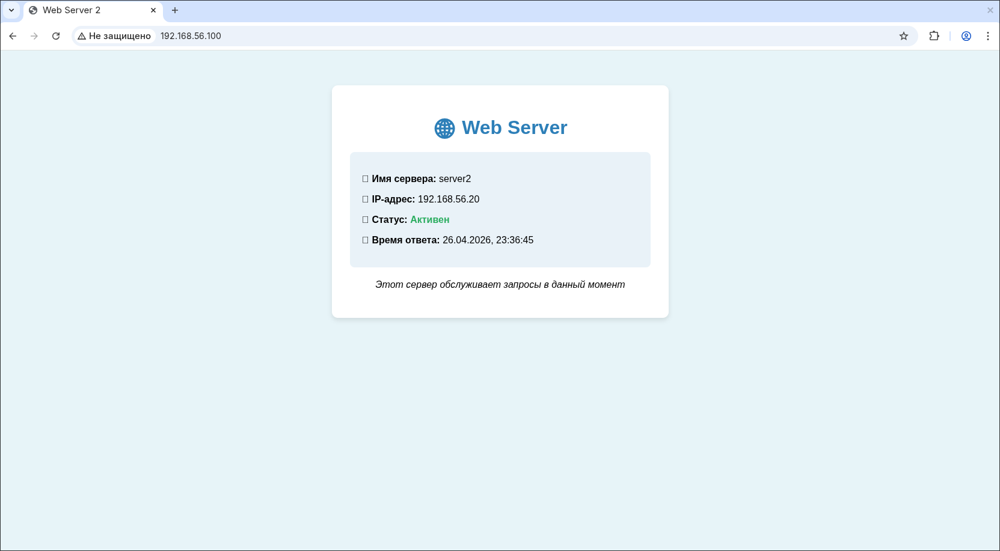

# Домашнее задание к занятию "Prometheus" - Валик Александр

### Задание 1

1. Настроено отслеживание состояния интерфейсов Gi0/0 (для первой группы) аналогично настройкам интерфейсов маршрутизаторов Gi0/1 (для нулевой группы). (Файл hsrp_advanced-hw.pkt)

2. Для проверки корректности настроек разорваны поочередно линии связи между маршрутизаторами и коммутаторами, ping между PC0 и Server0 проходит нормально.

 ---

### Задание 2

1. Запущены две виртуальные машины Linux, установлен и настроен сервис Keepalived.

2. Настроен веб-сервер nginx на двух виртуальных машинах.

3. Написан Bash-скрипт, который проверяет доступность порта данного веб-сервера и существование файла index.html в root-директории данного веб-сервера. (Файл check_web.sh)

4. Keepalived настроен так, чтобы он запускал данный скрипт каждые 3 секунды и переносил виртуальный IP на другой сервер, если bash-скрипт завершался с кодом, отличным от нуля. (keepalived_1.conf, keepalived_2.conf)

